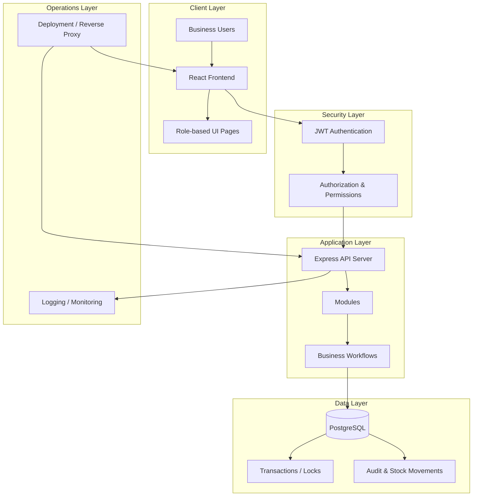
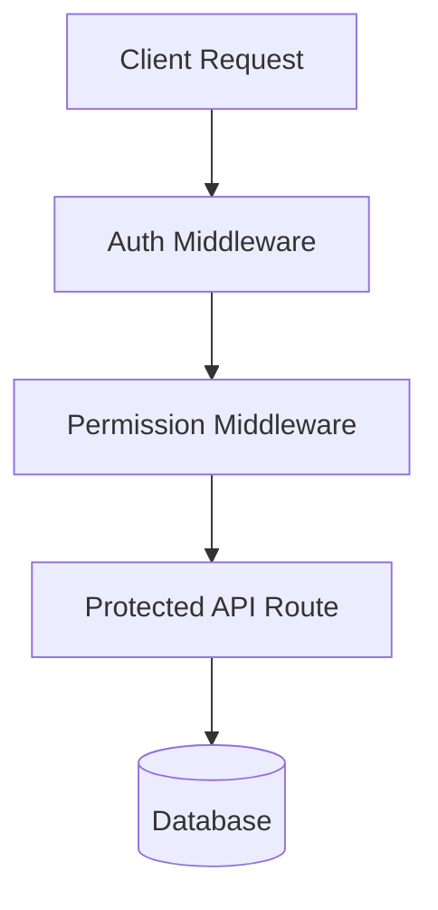
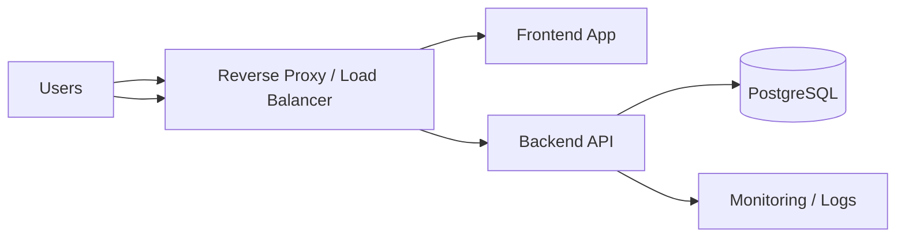

# System Architecture — One8 ERP-CRM

## 1. Executive Overview

One8 ERP-CRM is a role-based enterprise operations platform for distributors and trading businesses. It unifies customer management, inventory control, challan processing, invoicing, payment tracking, and administrative governance into a single web-based system.

### Architecture Style
- Layered architecture
- Modular business-domain design
- Role-based access control
- Transaction-safe database operations
- Cloud-ready deployment model

---

## 2. Block-wise System Architecture

---

## 3. Layer Details

### 3.1 Client Layer
- React-based user interface
- Dashboard, CRM, inventory, finance, and admin screens
- Dynamic navigation based on user role and permissions

### 3.2 Security Layer
- JWT authentication for session management
- Middleware-based request validation
- Role and permission enforcement before any business operation

### 3.3 Application Layer
- Express.js server handling all business endpoints
- Domain modules for authentication, customers, products, inventory, challans, invoices, payments, and users
- Core workflows such as stock deduction, invoice linkage, and payment tracking

### 3.4 Data Layer
- PostgreSQL as the transactional database
- Structured relational storage for operations and audit trails
- Atomic operations for inventory updates and challan confirmation

### 3.5 Operations Layer
- Logging and monitoring support
- Reverse proxy and deployment support
- Suitable for cloud hosting and future scaling

---

## 4. Functional Blocks

### A. User Interaction Block
- Login and session handling
- Dashboard and page navigation
- CRUD-based business forms

### B. Business Logic Block
- Customer lifecycle management
- Inventory and stock adjustment workflows
- Challan creation and confirmation flow
- Invoice and payment processing

### C. Authorization Block
- User role validation
- Feature access checks
- Admin override for custom permissions

### D. Persistence Block
- Data storage for all business entities
- Transaction safety and rollback on failure
- Audit records for stock and financial changes

---

## 5. Core Workflow Blocks

### Authentication Flow
1. User logs in through the client
2. Server validates credentials
3. JWT is issued and attached to subsequent requests
4. Middleware validates the token and checks permissions
5. Access is granted only if permitted

### Challan Processing Flow
1. Challan is created or edited
2. Business rules are validated
3. Inventory availability is checked
4. Transaction begins
5. Stock is deducted atomically
6. Stock movement records are created
7. Challan status is updated
8. Transaction commits or rolls back

---

## 6. Security Block Diagram

### Security Controls
- JWT-based identity verification
- Permission enforcement at the API layer
- Role-based UI restriction for user experience safety
- Validation of all input before business logic execution

---

## 7. Data Block Architecture

### Primary Data Entities
- Users
- Roles
- Permissions
- Customers
- Products
- Stock Movements
- Challans
- Invoices
- Payments
- Settings

### Data Design Principles
- Relational model for consistency
- Transactional integrity for financial and inventory updates
- Clear relationships between business entities
- Audit trail support for operational visibility

---

## 8. Deployment Block View

### Deployment Blocks
- Frontend hosted on a web server or static hosting platform
- Backend deployed as a Node.js service
- PostgreSQL hosted in a managed database environment
- Reverse proxy for secure routing and traffic management

---

## 9. Summary

This architecture is organized into clear functional blocks:
- Client block for user interaction
- Security block for access control
- Application block for business logic
- Data block for persistence and transactions
- Operations block for deployment and monitoring

This makes the system suitable for a robust business application and provides a strong base for future expansion into advanced reporting, automation, and enterprise integrations.
